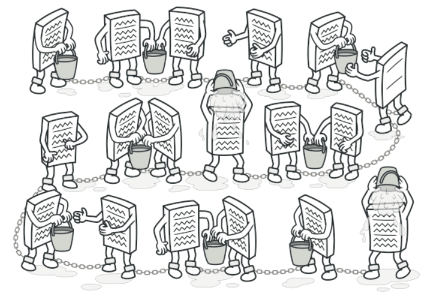
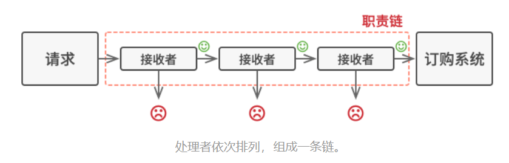
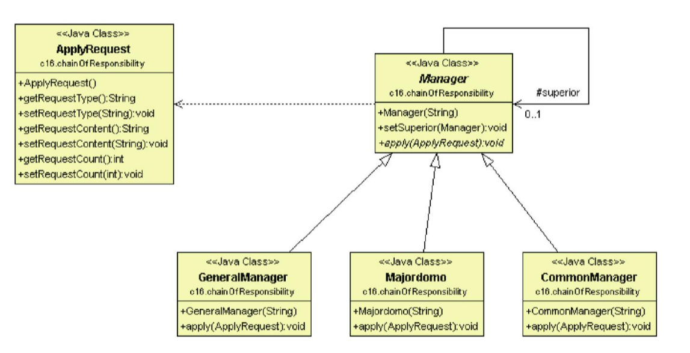

# 責任鏈模式

## 目的

讓不同物件有機會處理同一個請求





## 背景故事

當員工提出休假申請時, 如果2天以下, 組經理可以批准, 2~5天則是高階主管批准, 超過5天則是總經理。另外員工提出加薪要求, 則由總經理批准。<br>

如果提出申請的動作封裝成一個請求(Request)類別, 處理請求的物件則抽出成處理者介面(Handler), 上面的主管就是實體處理者(Concrete Handler)<br>

比啟用if-else處理, 使用**責任鏈**會更容易調整, 例如公司臨時要改成5天以下由組經理批准, 5天以上是總經理, 那只要在客戶端重新設定責任鏈就好。

## 類別圖



## 適用場景

- 當程式須要使用不同方式處理不同種類的請求, 且請求類型和順序未知

- 必須按順序處理多個請求

- 處理順序可能隨時改變

## 優點

- 可以控制處理順序

- 單一職責, 開閉原則

## 缺點

- 部分請求可能未被處理

## 程式寫法 - C#

1. Request

    ```Csharp
    public class ApplyRequest
    {
        public string requestType { get; set; }

        public string requestContent { get; set; }

        public int requestCount { get; set; }
    }
    ```

2. Handler 介面

    ```Csharp
    public abstract class Manager
    {
        public string name { get; set; }

        protected Manager superior; //上一級管理者

        public Manager(string name) 
        {
            this.name = name;
        }

        //設定上一級管理者
        public void setSuperior(Manager superior) 
        {
            this.superior = superior;
        }

        //提出申請
        public abstract void apply(ApplyRequest request);
    }
    ```

3. Handler 實體

    ```Csharp
    //經理
    public class CommonManager : Manager 
    {
        public CommonManager(string name) : base(name) { }

        public override void apply(ApplyRequest request)
        {
            //2天以下批准
            if (request.requestType.Equals("break") && request.requestCount <= 2)
            {
                Console.WriteLine(request.requestType + " : " + request.requestContent);
                Console.WriteLine(request.requestCount + " is applied by " + this.name);
            }
            else 
            {
                if (this.superior != null) 
                {
                    this.superior.apply(request);
                }
            }
        }
    }

    //總監
    public class MajorDemo : Manager
    {
        public MajorDemo(string name) : base(name) { }

        public override void apply(ApplyRequest request)
        {
            //5天以下批准
            if (request.requestType.Equals("break") && request.requestCount <= 5)
            {
                Console.WriteLine(request.requestType + " : " + request.requestContent);
                Console.WriteLine(request.requestCount + " is applied by " + this.name);
            }
            else
            {
                if (this.superior != null)
                {
                    this.superior.apply(request);
                }
            }
        }
    }

    //總經理
    public class GeneralManager : Manager
    {
        public GeneralManager(string name) : base(name) { }

        public override void apply(ApplyRequest request)
        {
            if (request.requestType.Equals("break"))
            {
                Console.WriteLine(request.requestType + " : " + request.requestContent);
                Console.WriteLine(request.requestCount + " is applied by " + this.name);
            }
            else
            {
                Console.WriteLine(" Error Message");
            }
        }
    }
    ```

4. 測試結果

    ```Csharp
    class Program
    {
        static void Main(string[] args)
        {
            Manager pm = new CommonManager("PM");

            Manager gl = new MajorDemo("GL");

            Manager gm = new GeneralManager("GM");

            //設定上級
            pm.setSuperior(gl);
            gl.setSuperior(gm);

            //請假
            ApplyRequest request = new ApplyRequest();
            request.requestType = "break";
            request.requestContent = "Miller break";
            request.requestCount = 2;
            pm.apply(request);

            request.requestContent = "Miller break";
            request.requestCount = 4;
            pm.apply(request);

            request.requestContent = "Miller break";
            request.requestCount = 30;
            pm.apply(request);

            Console.ReadKey();
        }
    }
    ```

## 程式寫法 - python

1. Request

    ```python
    class ApplyRequest:
        def __init__(self):
            self.requestType = None
            self.requestContent = None
            self.requestCount = 0
    ```

2. Handler 介面

    ```python
    from abc import ABC, abstractmethod
    from Request import ApplyRequest

    class Manager(ABC):
        def __init__(self, name: str):
            self.name = name
            self.superior = None

        def set_superior(self, superior):
            self.superior = superior

        @abstractmethod
        def apply(self, request: ApplyRequest):
            pass
    ```

3. Handler 實體

    ```python
    class CommonManager(Manager):
        def __init__(self, name: str):
            super().__init__(name)

        def apply(self, request: ApplyRequest):
            if request.requestType == "break" and request.requestCount <= 2:
                print(request.requestType + " : " + request.requestContent)
                print(str(request.requestCount) + " is applied by " + self.name)
            elif self.superior is not None:
                self.superior.apply(request)

    class MajorDemo(Manager):
        def __init__(self, name: str):
            super().__init__(name)

        def apply(self, request: ApplyRequest):
            if request.requestType == "break" and request.requestCount <= 5:
                print(request.requestType + " : " + request.requestContent)
                print(str(request.requestCount) + " is applied by " + self.name)
            elif self.superior is not None:
                self.superior.apply(request)

    class GeneralManager(Manager):
        def __init__(self, name: str):
            super().__init__(name)

        def apply(self, request: ApplyRequest):
            if request.requestType == "break":
                print(request.requestType + " : " + request.requestContent)
                print(str(request.requestCount) + " is applied by " + self.name)
            else:
                print("Error Message")
    ```

4. 測試結果

    ```python
    from Handler import GeneralManager, MajorDemo, CommonManager
    from Request import ApplyRequest

    pm = CommonManager("PM")
    gl = MajorDemo("GL")
    gm = GeneralManager("GM")

    # 設定上級
    pm.set_superior(gl)
    gl.set_superior(gm)

    # 請假
    request = ApplyRequest()
    request.requestType = "break"
    request.requestContent = "Miller break"
    request.requestCount = 2
    pm.apply(request)

    request.requestContent = "Miller break"
    request.requestCount = 4
    pm.apply(request)

    request.requestContent = "Miller break"
    request.requestCount = 30
    pm.apply(request)
    ```
