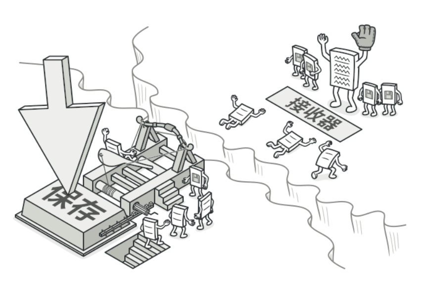
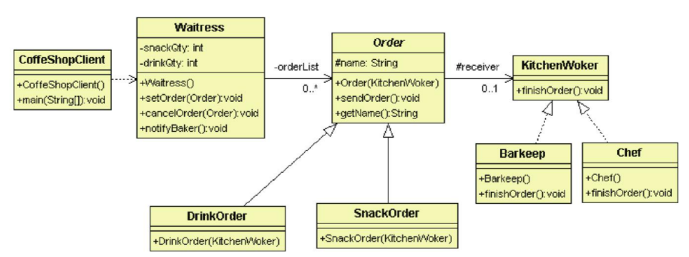

# 命令模式

## 目的

將各種請求(Command)封裝成一個物件。<br>

客戶端不直接發送請求給命令執行者, 而是將請求都交給接收者(Invoker), 再由接收者轉交給命令執行者。<br>

接收者可將請求排成工作序列, 也可移除尚未執行的請求。



## 背景故事

在一家冒險者飲料店中, 外場有服務生(Invoker)來接收冒險者(Client)的點餐訂單(Command)<br>
目前飲料店有提供飲料跟點心, 因此分成飲料訂單(Concrete Command)跟點心訂單(Concrete Command)兩種, 全部的訂單都由廚房人員處理(Receiver)<br>
飲料訂單由飲料師(Concrete Receiver)調理, 點心訂單(Concrete Receiver)由廚師調理<br>
如此一來, 廚房人員不必與冒險者接觸, 服務生也能隨時調整跟確認訂單。

## 類別關係圖



- Waitress (Invoker): 
  
  - 知道產品的總數

  - 控制訂單的新增與刪除

  - 將訂單送到廚房

- Order (Command): 

  - 設定訂單名稱

  - 將訂單送給廚房人員

- KitchenWorker (Receiver):

  - 處理訂單

## 適用場景

- 如果需要透過操作來參數化物件

- 如果需要將操作放在對列中

- 如果想實現操作回滾功能

## 優點

- 可以實現撤銷和恢復

- 可以延遲執行

## 缺點

- 因為在發送者跟接收者中間加一個的全新的層次, 可能使程式碼變得複雜

## 程式寫法 - C#

1. 廚房人員介面(Receiver) & 具體化(Concrete Receiver)

    ```Csharp
    public abstract class KitchenWorker
    {
        //完成訂單
        public abstract void finishOrder();
    }

    //飲料師
    public class Barkeep : KitchenWorker 
    {
        public override void finishOrder() 
        {
            Console.WriteLine("Complete Baverage");
        }
    }

    //廚師
    public class Chef : KitchenWorker
    {
        public override void finishOrder()
        {
            Console.WriteLine("Complete Food");
        }
    }
    ```

2. 訂單介面(Command) & 具體化(Concrete Command)

    ```Csharp
    public abstract class Order
    {
        //廚房工作者(receiver)
        protected KitchenWorker receiver;
        
        public string name { get; set; }

        public Order(KitchenWorker receiver)
        {
            this.receiver = receiver;
        }

        //將訂單送給廚房人員
        public void sendOrder() 
        {
            this.receiver.finishOrder();
        }
    }

    public class DrinkOrder : Order
    { 
        public DrinkOrder(KitchenWorker receiver) : base(receiver) 
        {
            base.name = "drinkOrder";
        }
    }

    public class SnakeOrder : Order
    {
        public SnakeOrder(KitchenWorker receiver) : base(receiver)
        {
            base.name = "snakeOrder";
        }
    }
    ```

3. 服務生(Invoker)

    ```Csharp
    //服務生
    public class Waitress
    {
        private int snakeQty = 2;

        private int drinkQty = 4;

        private List<Order> orderList = new List<Order>();

        //接收訂單
        public void setOrder(Order order) 
        {
            if (order.name.Equals("snakeOrder")) 
            {
                if (this.snakeQty <= 0)
                {
                    Console.WriteLine("Snake sold out");
                }
                else
                {
                    Console.WriteLine("Add snake order");
                    snakeQty--;
                    orderList.Add(order);
                }
            }

            if (order.name.Equals("drinkOrder"))
            {
                if (this.drinkQty <= 0)
                {
                    Console.WriteLine("Drink sold out");
                }
                else
                {
                    Console.WriteLine("Add drink order");
                    drinkQty--;
                    this.orderList.Add(order);
                }
            }
        }

        //取消訂單
        public void cancelOrder(Order order)
        {
            if (order.name.Equals("snakeOrder"))
            {
                snakeQty++;
                Console.WriteLine("Cancel snake order");
            }

            if (order.name.Equals("drinkOrder"))
            {
                drinkQty++;
                Console.WriteLine("Cancel drink order");
            }

            this.orderList.Remove(order);
        }

        //將訂單送到廚房
        public void notifyBaker() 
        {
            foreach (var order in this.orderList)
            {
                order.sendOrder();
            }

            this.orderList.Clear();
        }
    }
    ```

4. 測試

   ```Csharp
   static void Main(string[] args)
        {
            //開店準備
            KitchenWorker snackChef = new Chef();
            KitchenWorker barkKeep = new Barkeep();

            Order drinkOrder = new DrinkOrder(barkKeep);
            Order snackOrder = new SnakeOrder(snackChef);

            Waitress waitress = new Waitress();

            //開始營業, 客人點餐
            waitress.setOrder(snackOrder);
            waitress.setOrder(snackOrder);
            waitress.setOrder(drinkOrder);
            waitress.setOrder(drinkOrder);
            waitress.setOrder(snackOrder);

            //取消點心
            waitress.cancelOrder(snackOrder);
            waitress.setOrder(snackOrder);

            //通知廚房
            waitress.notifyBaker();

            Console.ReadKey();
        }
   ```

## 程式寫法 - python

1. 廚房人員介面(Receiver) & 具體化(Concrete Receiver)

    ```python
    from abc import ABC, abstractmethod

    class KitchenWorker(ABC):
        @abstractmethod
        def finishOrder(self):
            pass

    class Barkeep(KitchenWorker):
        def finishOrder(self):
            print("Complete Baverage")

    class Chef(KitchenWorker):
        def finishOrder(self):
            print("Complete Food")
    ```

2. 訂單介面(Command) & 具體化(Concrete Command)

    ```python
    from abc import ABC, abstractmethod
    from KitchenWorker import KitchenWorker

    class Order(ABC):
        def __init__(self, receiver: KitchenWorker):
            self.name = None
            self.receiver = receiver
    
        def sendOrder(self):
            self.receiver.finishOrder()

    class DrinkOrder(Order):
        def __init__(self, receiver: KitchenWorker):
            super().__init__(receiver)
            self.name = "drinkOrder"

    class SnakeOrder(Order):
        def __init__(self, receiver: KitchenWorker):
            super().__init__(receiver)
            self.name = "snakeOrder"
    ```

3. 服務生(Invoker)

    ```python
    from Order import Order

    class Waitress():
        def __init__(self):
            self.__snakeQty = 2
            self.__drinkQty = 4
            self.__orderList = []
    
        #接收訂單
        def setOrder(self, order: Order):
            if(order.name == "snakeOrder"):
                if (self.__snakeQty <= 0):
                    print("Snake sold out")
                else:
                    print("Add snake order")
                    self.__snakeQty = self.__snakeQty - 1
                    self.__orderList.append(order)

            if(order.name == "drinkOrder"):
                if (self.__drinkQty <= 0):
                    print("Drink sold out")
                else:
                    print("Add drink order")
                    self.__drinkQty = self.__drinkQty - 1
                    self.__orderList.append(order)

        #取消訂單
        def cancelOrder(self, order: Order):
            if (order.name == "snakeOrder"):
                self.__snakeQty = self.__snakeQty + 1
                print("Cancel snake order")

            if (order.name == "drinkOrder"):
                self.__drinkQty = self.__drinkQty + 1
                print("Cancel drink order")
                self.__orderList.remove(order)
    
        #將訂單送到廚房
        def notifyBaker(self): 
            for order in self.__orderList:
                order.sendOrder()
            self.__orderList.clear()
    ```

4. 測試

    ```python
    from KitchenWorker import Barkeep, Chef
    from Order import DrinkOrder, SnakeOrder
    from Invoker import Waitress

    #開店準備
    snackChef = Chef()
    barkKeep = Barkeep()

    drinkOrder = DrinkOrder(barkKeep)
    snackOrder = SnakeOrder(snackChef)

    waitress = Waitress()

    #開始營業, 客人點餐
    waitress.setOrder(snackOrder)
    waitress.setOrder(snackOrder)
    waitress.setOrder(drinkOrder)
    waitress.setOrder(drinkOrder)
    waitress.setOrder(snackOrder)

    #取消點心
    waitress.cancelOrder(snackOrder)
    waitress.setOrder(snackOrder)

    #通知廚房
    waitress.notifyBaker()
    ```