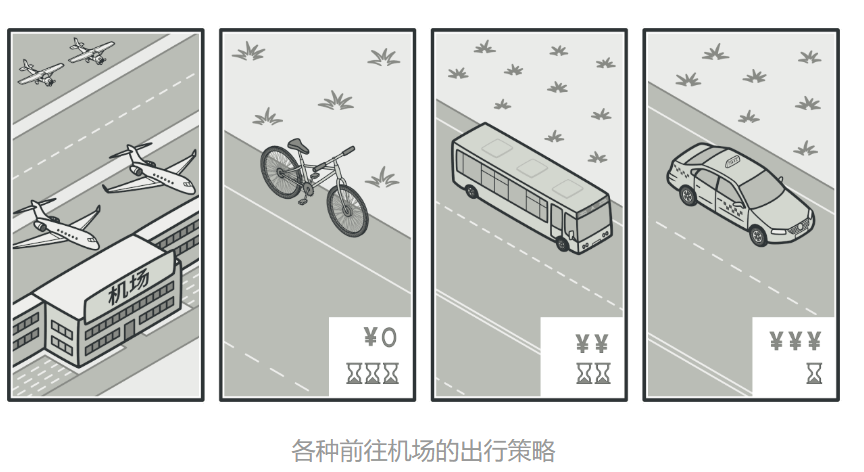
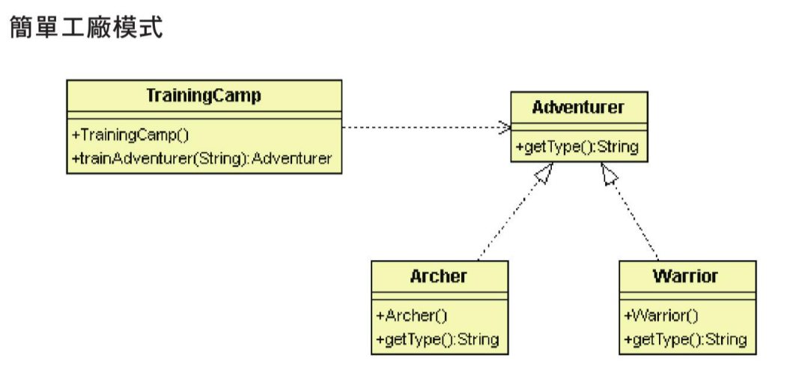
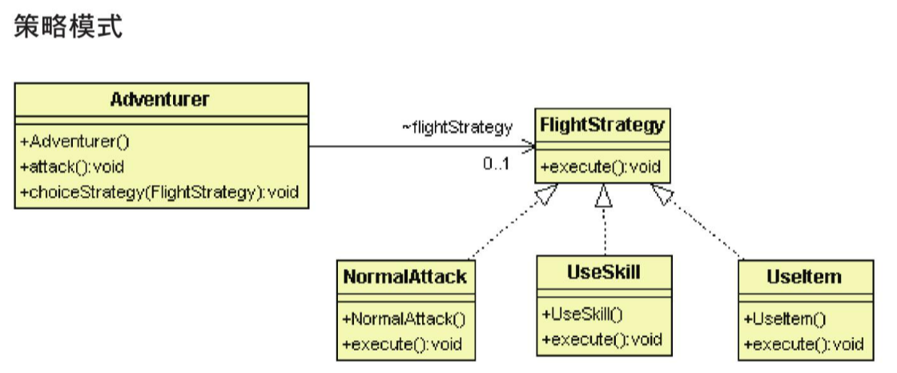

# 策略模式

## 目的

將各種可以互換的演算法(策略), 包裝成一個類




## 背景故事

冒險者必須使用不同的策略來對付不同的怪物，因此需有一個策略界面，並且建立各種實體策略。

## 適用場景

- 需要在運行時切換不同的演算法

- 當有許多僅在執行某些行為時的相似類時

## 優點

- 可以使用組合來代替繼承

- 可以將算法與使用隔離開來

## 缺點

- 客戶端必須知道算法具體不同

## 程式寫法 - C#

1. 創建策略

    ```Csharp
    public abstract class FlightStrategy
    {
        public abstract void execute();
    }

    public class NormalAttack : FlightStrategy
    {
        public override void execute()
        {
            Console.WriteLine("execute normal attack ");
        }
    }

    public class UseSkill : FlightStrategy
    {
        public override void execute()
        {
            Console.WriteLine("execute skill attack ");
        }
    }

    public class UseItem : FlightStrategy
    {
        public override void execute()
        {
            Console.WriteLine("execute item attack ");
        }
    }
    ```

2. 創建冒險者使用界面 (環境類別)

    ```Csharp
    class Adventure
    {
        FlightStrategy flightStrategy;

        public void attack() 
        {
            if (flightStrategy == null) 
            {
                flightStrategy = new NormalAttack();
            }
            flightStrategy.execute();
        }

        public void choiceStrategy(FlightStrategy strategy)
        {
            this.flightStrategy = strategy;
        }
    }
    ```

3. 測試結果

    ```Csharp
    class Program
    {
        static void Main(string[] args)
        {
            Adventure adventure = new Adventure();

            adventure.choiceStrategy(new NormalAttack());
            adventure.attack();

            adventure.choiceStrategy(new UseSkill());
            adventure.attack();

            adventure.choiceStrategy(new UseItem());
            adventure.attack();

            Console.ReadKey();
        }
    }
    ```

## 程式寫法 - python

1. 創建策略

    ```python
    class FlightStrategy:
        def execute(self):
            pass

    class NormalAttack(FlightStrategy):
        def execute(self):
            print("execute normal attack ")

    class UseSkill(FlightStrategy):
        def execute(self):
            print("execute skill attack")

    class UseItem(FlightStrategy):
        def execute(self):
            print("execute item attack")
    ```

2. 創建冒險者使用界面 (環境類別)

    ```python
    class Adventure:
        def __init__(self):
            self.flightStrategy = None

        def attack(self):
            if self.flightStrategy is None:
                self.flightStrategy = NormalAttack()
            self.flightStrategy.execute()

        def chooseStrategy(self, strategy):
            self.flightStrategy = strategy
    ```

3. 測試結果

    ```python
    adventure = Adventure()

    adventure.chooseStrategy(NormalAttack())
    adventure.attack()

    adventure.chooseStrategy(UseSkill())
    adventure.attack()

    adventure.chooseStrategy(UseItem())
    adventure.attack()
    ```

## 策略模式 vs 簡單工廠模式





從類別關係圖可以看到兩者幾乎沒有差別，但從我們的範例中可以區分為:

-  簡單工廠模式: 訓練營提供不同的冒險者，至於該冒險者要做什麼事情，跟訓練營無關

-  策略模式: 冒險者選擇不同的策略來攻擊怪物，關注點在於策略本身，而不是使用策略的冒險者，至於策略怎麼產生，使用者並不在乎

綜上所述，兩者差別在於，簡單工廠模式的工廠類別並不會使用產品，因為其只關注如何產生物件; 策略模式中的冒險者使用界面 (環境類別) 則是使用由外部傳入的策略類別，因此必須知道策略的實際內容。<br>

總結如下:

- 簡單工廠模式是用來創建物件的模式，關注物件如何被產生

- 策略模式是一種行為模式，關注行為的封裝


