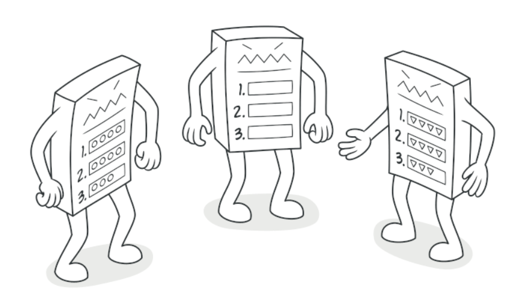
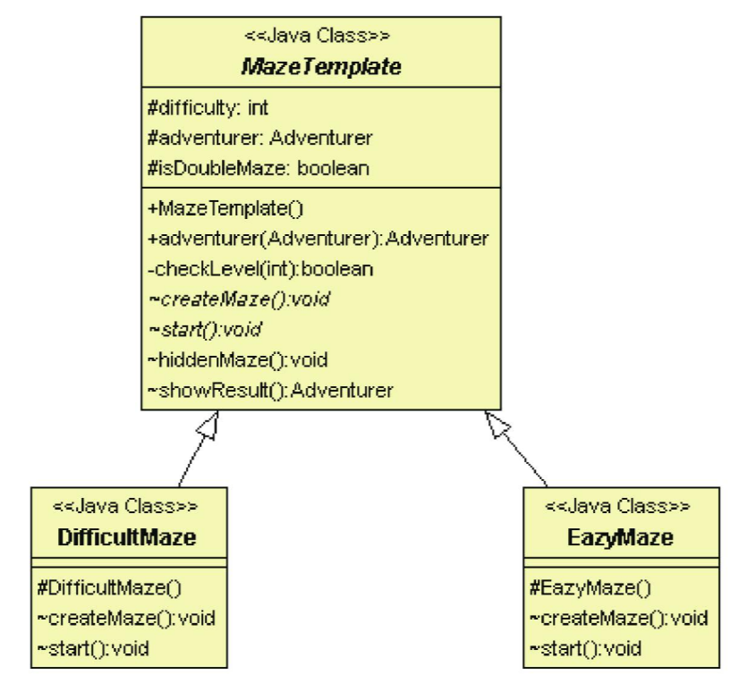

# 樣板模式

## 目的

定義一套演算法的結構, 但是細節可以延遲到子類別再決定



## 背景故事

迷宮探險對於冒險者來說是很重要的活動, 冒險者盡如迷宮探險的步驟如下:

- 冒險者等級是否到達迷宮門檻

- 冒險者等級到達迷宮門檻才開始產生迷宮 (每個迷宮長的都不一樣)

- 冒險者探險 (省略)

- 計算探險結果

從上可知, 冒險者進入迷宮前後的過程是一樣的, 而對於這些同樣的過程, 可以使用**樣板**來規範

## 類別圖



## 適用場景

- 只希望客戶端擴展某個特定算法步驟, 而不是整個算法架構

- 當許多類除了細微不同外, 其他完全一樣時

## 優點

- 可允許客戶端重寫一個大型算法的某個特定部分

- 可將重複程式碼提取至一個父類

## 缺點

- 客戶端可能受到算法框架限制

- 樣板方法越多, 期維護工作就越困難

## 程式寫法 - C#

1. 建立冒險者

    ```Csharp
    public abstract class Adventurer
    {
        public int level { get; set; }
        public string type { get; set; }
    }

    public class GundamJustice : Adventurer 
    {
        public GundamJustice() 
        {
            base.type = "Gundam-Justice";
            base.level = 100;
        }
    }

    public class Sabar : Adventurer
    {
        public Sabar()
        {
            base.type = "Sabar";
            base.level = 10;
        }
    }
    ```

2. 迷宮樣板與實作

    ```Csharp
    public abstract class MazeTemplete
    {
        public int difficulty { get; set; }

        public Adventurer adventurer;

        public bool isDoubleMaze = false; //hook: 決定是否有隱藏迷宮

        public Adventurer adventur(Adventurer adventurer) 
        {
            this.adventurer = adventurer;

            //確認冒險者等級
            if (!checkLevel(this.adventurer.level))
            {
                Console.WriteLine("Level is not enough ");
            }
            else 
            {
                Console.WriteLine(this.GetType().Name + " rise up the difficulty ");
                
                //產生迷宮
                createMaze();
                
                //闖迷宮
                start();
                
                //掛勾: 隱藏迷宮
                if (isDoubleMaze) 
                {
                    hiddenMaze();
                }

                //結束冒險
                showResult();
            }

            return this.adventurer;
        }

        private bool checkLevel(int level) 
        {
            if (level < this.difficulty) 
            {
                return false;
            }

            return true;
        }

        //迷宮內容
        public abstract void createMaze();

        //進入迷宮
        public abstract void start();

        //掛勾: 隱藏迷宮
        public void hiddenMaze() 
        {
            Console.WriteLine("Go to hidden maze ");
        }

        //冒險結束
        public Adventurer showResult() 
        {
            //等級增加
            this.adventurer.level = this.adventurer.level + 50 * this.difficulty;

            Console.WriteLine(this.GetType().Name + " Complete Maze difficulty: " + this.difficulty);

            return this.adventurer;
        }
    }

    //簡單迷宮
    public class EasyMaze : MazeTemplete 
    {
        public EasyMaze() 
        {
            base.difficulty = 1;
        }

        public override void createMaze()
        {
            Console.WriteLine("!!! Generated Easy Maze !!! " );
        }

        public override void start()
        {
            Console.WriteLine("-- start Easy Maze --");
        }
    }

    //困難迷宮
    public class DifficultMaze : MazeTemplete
    {
        public DifficultMaze()
        {
            base.isDoubleMaze = true; //困難模式有隱藏關卡
            base.difficulty = 50; //等級50才能進入迷宮
        }

        public override void createMaze()
        {
            Console.WriteLine("### Generated Difficult Maze ### ");
        }

        public override void start()
        {
            Console.WriteLine("-*- start Difficult Maze -*-");
        }
    }
    ```

3. 測試結果

    ```Csharp
    class Program
    {
        static void Main(string[] args)
        {
            Adventurer sabar = new Sabar(); //等級10的劍士
            Adventurer justice = new GundamJustice(); //等級100的正義鋼彈

            MazeTemplete easyMaze = new EasyMaze(); //簡單迷宮
            MazeTemplete hardMaze = new DifficultMaze(); //複雜迷宮

            // 劍士進入迷宮
            sabar = hardMaze.adventur(sabar);
            sabar = easyMaze.adventur(sabar);
            Console.WriteLine("sabar level: " + sabar.level);

            Console.WriteLine("");
            Console.WriteLine("==========================");
            Console.WriteLine("");

            // 劍士再次挑戰迷宮
            sabar = hardMaze.adventur(sabar);
            Console.WriteLine("sabar level: " + sabar.level);

            Console.WriteLine("");
            Console.WriteLine("==========================");
            Console.WriteLine("");

            // 正義鋼彈進入迷宮
            justice = hardMaze.adventur(justice);
            Console.WriteLine("sabar level: " + justice.level);

            Console.ReadKey();
        }
    }
    ```

## 程式寫法 - python

1. 建立冒險者

    ```python

    ```

2. 迷宮樣板與實作

    ```python

    ```

3. 測試結果

    ```python

    ```

## 後記

**工廠模式**是**樣板模式**的一種特殊形式, 同時, **工廠模式**可以做為**樣板模式**的一個步驟。