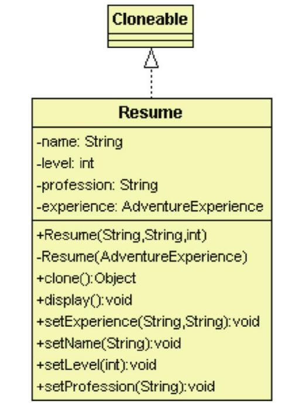

# 原型模式

## 目的

複製一個物件, 而不是重新創建一個


## 背景故事

當需要建立的新物件與原有物件很相似, 想直接複製原有物件再修改就好, 此時就可以使用**原型模式**<br>

冒險者協會有專門的人力資源單位來管理冒險者的履歷, 為了方便冒險者更新自己的履歷, 協會提供複製履歷的功能<br>

## 類別圖



## 適用場景

- 如果需要複製一些物件, 但又希望這些程式碼獨立於這些物件所屬的具體類

- 這些子類區別在於其物件的初始化方式

## 優點

- 可以複製物件, 而無須與他們的所屬物件相耦合

- 可複製預生成原型, 避免反覆運行初始化過程

- 可以更方便的反覆生成複雜物件

- 可以使用繼承以外的方式來處理複雜物件的不同配置

## 缺點

- 複製包含循環引用的複雜物件可能會非常麻煩

## 程式寫法 - C#

1. 原型與複製對象

    ```Csharp
    //冒險者履歷
    public class Resume : ICloneable
    {
        public string name { get; set; }

        public int level { get; set; }

        public string profession { get; set; }

        public AdventureExperience experience { get; set; }

        public Resume(string name, string profession, int level)
        {
            this.name = name;
            this.level = level;
            this.profession = profession;
            this.experience = new AdventureExperience();
        }

        //overloading 重載: C#中可以有多個構造函式
        public Resume(AdventureExperience experience) 
        {
            this.experience = (AdventureExperience)experience.Clone();
        }

        public void Display() 
        {
            Console.WriteLine($"冒險者：{name}-{profession} 等級:{level}");
            Console.WriteLine($"冒險經歷: {experience.date} {experience.location}");
            Console.WriteLine();
        }

        public object Clone()
        {
            Resume clone = new Resume(experience.Clone() as AdventureExperience);
            clone.name = this.name;
            clone.level = this.level;
            clone.profession = this.profession;
            return clone;
        }
    }

    //冒險者經歷
    public class AdventureExperience : ICloneable
    {
        public string date { get; set; }

        public string location { get; set; }

        public object Clone()
        {
            // 使用 MemberwiseClone 進行浅拷貝
            return this.MemberwiseClone();
        }
    }
    ```

2. 測試結果

    ```Csharp
    class Program
    {
        static void Main(string[] args)
        {
            Resume resume = new Resume("Jacke", "Newer", 1);
            resume.experience.date = "2021-01-01";
            resume.experience.location = "TW";

            Resume resume2 = (Resume)resume.Clone();
            resume2.level = 5;
            resume2.name = "Miller";
            resume2.experience.date = "2020-09-18";
            resume2.experience.location = "USA";

            Resume resume3 = (Resume)resume2.Clone();
            resume3.name = "Steve";
            resume3.profession = "fighter";
            resume3.level = 20;
            resume3.experience.date = "2019-11-22";
            resume3.experience.location = "CHA";

            Console.WriteLine("The First Resume");
            resume.Display();

            Console.WriteLine("The Second Resume");
            resume2.Display();

            Console.WriteLine("The Third Resume");
            resume3.Display();

            Console.ReadKey();
        }
    }
    ```
