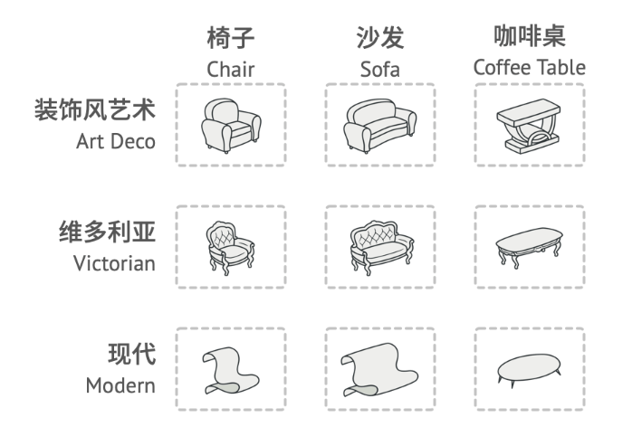

# 抽象工廠模式

## 目的

用一個工廠介面來產生一系列相關物件, 但實際建立那些物件由實做工廠的子類別來實現



## 簡單工廠 VS 工廠模式

- 簡單工廠: 工廠利用 if-else 來判斷生成的產品

- 工廠模式: 工廠只是概念, 由各個實體工廠實作各自產品

## 工廠模式 vs 抽象工廠模式

- 工廠模式: 注重如何生產一個物件, 例如弓箭手訓練營就只生產一個弓箭手

- 抽象工廠模式: 注重產品間的抽像關係, 例如武器跟衣服是不同物件, 但是都屬於同一個冒險者的裝備

## 適用場景

- 需要與多個不同系列的相關產品進行交互: 當程式碼需要與多種不同系列的相關產品進行交互，但無法提前獲取相關信息，或者基於未來擴展性的考慮不希望程式碼建立在具體產品類別的基礎上時，可以使用抽象工廠模式。

- 抽象工廠提供一個介面，用於創建每個系列產品的對象。只要程式碼通過該介面創建對象，就不會生成與應用程式已生成的產品類型不一致的產品。

## 優點

- 抽象程度提高

- 一致性, 擴展性, 隔離細節

## 缺點

- 增加了類的數量，尤其是在產品等級結構較複雜時，可能會產生大量的工廠類別。

## 程式寫法 - C#

冒險者需要有武器跟上衣兩種裝備, 冒險者又分為弓箭手跟鬥士兩種, 這樣就需要4種類, 當裝備變多或是冒險者變多就會使類別複雜難以管理。<br>

這種情境下, 就需要使用抽象工廠模式, 此時的工廠會生產一個冒險者類別的所有裝備，例如鬥士裝備生產工廠就會生產鬥士武器跟鬥士上衣。

### 裝備類與裝備工廠

1. 創建衣服產品類

    ```Csharp
    public abstract class Clothes
    {
        protected internal int def;

        public void display() 
        {
            Console.WriteLine(this.GetType().Name + " defense=" + def);
        }
    }

    public class Armor : Clothes
    {
    }

    public class Leather : Clothes
    {
    }
    ```

2. 創建武器產品類

    ```Csharp
    public abstract class Weapon
    {
        protected internal int atk;

        public void display()
        {
            Console.WriteLine(this.GetType().Name + " attack=" + atk);
        }
    }

    public class Sword : Weapon
    {
    }

    public class Bow : Weapon
    {
    }
    ```

3. 創建裝備虛擬工廠類

    ```CSharp
    public abstract class EquipmentFactory
    {
        public abstract Weapon produceWeapon();

        public abstract Clothes produceClothes();
    }
    ```

4. 創建勇士裝備工廠類

    ```CSharp
    public class WarriorEquipmentFactory : EquipmentFactory
    {
        public override Clothes produceClothes()
        {
            Clothes armor = new Armor();
            armor.def = 10;
            return armor;
        }

        public override Weapon produceWeapon()
        {
            Weapon sword = new Sword();
            sword.atk = 100;
            return sword;
        }
    }
    ```

5. 創建弓箭手裝備工廠類

    ```CSharp
    public class ArcherEquipmentFactory : EquipmentFactory
    {
        public override Clothes produceClothes()
        {
            Clothes leather = new Leather();
            leather.def = 8;
            return leather;
        }

        public override Weapon produceWeapon()
        {
            Weapon bow = new Bow();
            bow.atk = 102;
            return bow;
        }
    }
    ```

### 冒險者類與冒險者工廠

1. 冒險者類

    ```Csharp
    public abstract class Adventurer
    {
        protected internal Weapon weapon;
        
        protected internal Clothes clothes;

        public abstract void display();
    }

    public class Archer : Adventurer
    {
        public Archer()
        {
            EquipmentFactory archerEquipmentFactory = new ArcherEquipmentFactory();
            weapon = archerEquipmentFactory.produceWeapon();
            clothes = archerEquipmentFactory.produceClothes();
        }

        public override void display()
        {
            Console.WriteLine("this is an archer; show equipment data");
            weapon.display();
            clothes.display();
            Console.WriteLine("-------------------------------------");
        }
    }

    public class Warrior : Adventurer
    {
        public Warrior()
        {
            EquipmentFactory warriorEquipmentFactory = new WarriorEquipmentFactory();
            weapon = warriorEquipmentFactory.produceWeapon();
            clothes = warriorEquipmentFactory.produceClothes();
        }

        public override void display()
        {
            Console.WriteLine("this is a warrior; show equipment data");
            weapon.display();
            clothes.display();
            Console.WriteLine("-------------------------------------");
        }
    }
    ```

2. 冒險者工廠類

    ```Csharp
    public abstract class TrainingCamp
    {
        public abstract Adventurer trainAdventurer();
    }

    public class ArcherCamp : TrainingCamp
    {
        public override Adventurer trainAdventurer()
        {
            Console.WriteLine("train an Archar ");
            return new Archer();
        }
    }

    public class WarriorCamp : TrainingCamp
    {
        public override Adventurer trainAdventurer()
        {
            Console.WriteLine("train an Warrior ");
            return new Warrior();
        }
    }
    ```

## 程式寫法 - python

### 裝備類與裝備工廠

1. 創建衣服產品類

    ```python
    class Clothes:
        def __init__(self):
            self.defense = 0

        def display(self):
            print(f"{self.__class__.__name__} defense={self.defense}")

    class Armor(Clothes):
        pass

    class Leather(Clothes):
        pass
    ```

2. 創建武器產品類

    ```python
    class Weapon:
        def __init__(self):
            self.attack = 0

        def display(self):
            print(f"{self.__class__.__name__} attack={self.attack}")

    class Sword(Weapon):
        pass

    class Bow(Weapon):
        pass
    ```

3. 創建裝備虛擬工廠類

    ```python
    class EquipmentFactory:
        def produceWeapon(self):
            pass

        def produceClothes(self):
            pass
    ```

4. 創建勇士裝備工廠類

    ```python
    class WarriorEquipmentFactory(EquipmentFactory):
        def produceClothes(self):
            armor = Armor()
            armor.defense = 10
            return armor

        def produceWeapon(self):
            sword = Sword()
            sword.attack = 100
            return sword
    ```

5. 創建弓箭手裝備工廠類

    ```python
    class ArcherEquipmentFactory(EquipmentFactory):
        def produceClothes(self):
            leather = Leather()
            leather.defense = 8
            return leather

        def produceWeapon(self):
            bow = Bow()
            bow.attack = 102
            return bow
    ```

### 冒險者類與冒險者工廠

1. 冒險者類

    ```python
    class Adventurer:
        def __init__(self):
            self.weapon = None
            self.clothes = None

        def display(self):
            pass

    class Archer(Adventurer):
        def __init__(self):
            super().__init__() #super().__init__() 來調用父類的構造函數
            archerEquipmentFactory = ArcherEquipmentFactory()
            self.weapon = archerEquipmentFactory.produceWeapon()
            self.clothes = archerEquipmentFactory.produceClothes()

        def display(self):
            print("this is an archer; show equipment data")
            self.weapon.display()
            self.clothes.display()
            print("-------------------------------------")

    class Warrior(Adventurer):
        def __init__(self):
            super().__init__()
            warriorEquipmentFactory = WarriorEquipmentFactory()
            self.weapon = warriorEquipmentFactory.produceWeapon()
            self.clothes = warriorEquipmentFactory.produceClothes()

        def display(self):
            print("this is a warrior; show equipment data")
            self.weapon.display()
            self.clothes.display()
            print("-------------------------------------")
    ```

2. 冒險者工廠類

    ```python
    class TrainingCamp:
        def train_adventurer(self):
            pass

    class ArcherCamp(TrainingCamp):
        def trainAdventurer(self):
            print("train an Archer")
            return Archer()

    class WarriorCamp(TrainingCamp):
        def trainAdventurer(self):
            print("train a Warrior")
            return Warrior()
    ```


