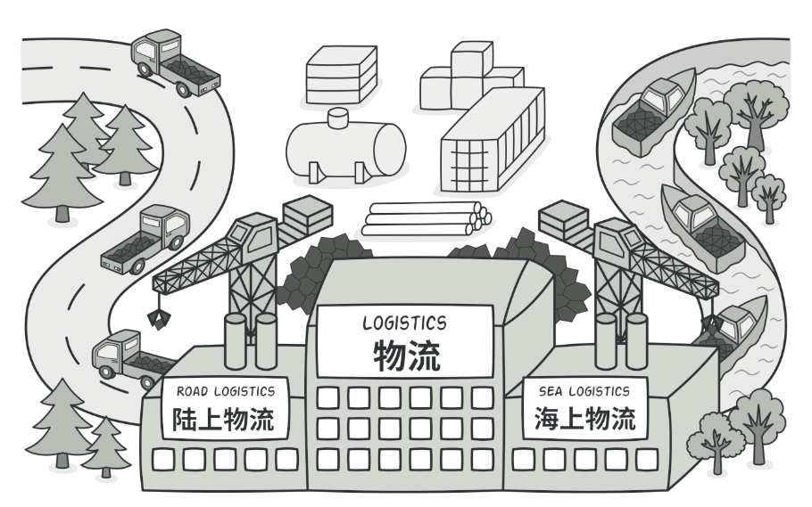

# 工廠模式

## 目的

簡單工廠模式因為只有一個工廠, 要新增產品會直接修改工廠類的程式碼, 違反了開放/封閉原則, 因此工廠模式要改成將工廠類變得抽象<br>
換言之, 抽象工廠類只會定義返回哪種產品, 實體工廠類則完成製作



## 簡單工廠 VS 工廠模式

- 簡單工廠: 工廠利用 if-else 來判斷生成的產品

- 工廠模式: 工廠只是概念, 由各個實體工廠實作各自產品

## 適用場景

- 當客戶端無需關心物件的具體實現細節，只需知道如何使用該物件時。

- 當一個類不能預先指定要創建的物件類別，需要在運行時才能確定時。

## 優點

- 便於擴展：當需要新增一個產品等級時，只需擴展相應的工廠類別，而不需要修改現有的代碼

## 缺點

- 增加了類的數量，尤其是在產品等級結構較複雜時，可能會產生大量的工廠類別。

## 程式寫法 - C#

1. 創建產品類

    ```Csharp
    public abstract class Adventurer
    {
        public abstract string getType();
    }

    public class Archar : Adventurer
    {
        public override string getType()
        {
            Console.WriteLine("this is Archar ");
            return this.GetType().Name;
        }
    }

    public class Warrior : Adventurer
    {
        public override string getType()
        {
            Console.WriteLine("this is Warrior ");
            return this.GetType().Name;
        }
    }
    ```

2. 創建虛擬工廠類: 冒險者訓練營

    ```CSharp
    abstract class TrainingCamp
    {
        public abstract Adventurer trainAdventurer();
    }
    ```

3. 創建工廠類: 弓箭手與勇者訓練營

    ```CSharp
    public class ArcharCamp : TrainingCamp
    {
        public override Adventurer trainAdventurer()
        {
            Console.WriteLine("train an Archar ");
            return new Archar();
        }
    }

    public class WarriorCamp : TrainingCamp
    {
        public override Adventurer trainAdventurer()
        {
            Console.WriteLine("train an Warrior ");
            return new Warrior();
        }
    }
    ```

## 程式寫法 - python

- 創建產品類

    ```python
    class Adventurer:
        def getType(self):
            pass

    class Warrior(Adventurer):
        def getType(self):
            print("This is Warrior")
            return type(self).__name__

    class Archer(Adventurer):
        def getType(self):
            print("This is Adventurer")
            return type(self).__name__
    ```

- 創建虛擬工廠類: 冒險者訓練營

    ```python
    class TrainingCamp:
        def trainAdventurer(self):
            pass
    ```

- 創建工廠類: 弓箭手與勇者訓練營

    ```python
    class ArcherCamp(TrainingCamp):
        def trainAdventurer(self):
            print("train an Archar")
            return Archer()

    class WarriorCamp(TrainingCamp):
        def trainAdventurer(self):
            print("train an Warrior")
            return Warrior()
    ```


