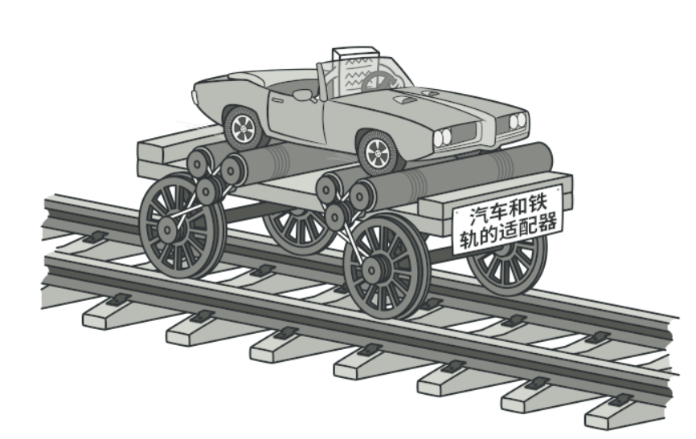
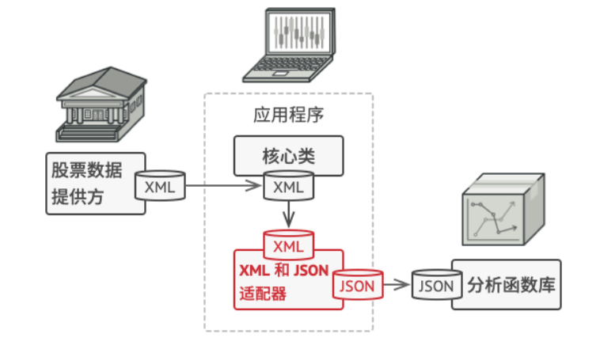
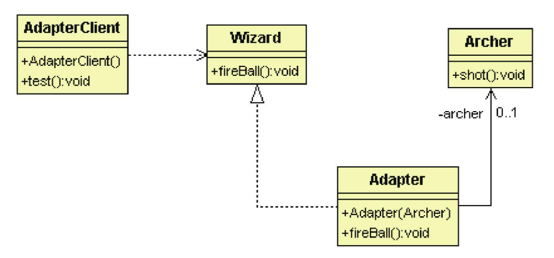

# 轉接器模式

## 目的

將一個介面轉換成另一個介面





## 背景故事

一群冒險者出門解任務, 才發現該任務需要一名會丟火球的法師才能解, 為了方便起見, 乾脆請弓箭手將弓箭包上布點火射出去, 來模擬法師丟火球的動作<br>

上面的概念就是使用**轉接器模式**, 弓箭手是被轉接者(Adaptee), 法師是轉接後的介面(Target), 還有負責轉接的轉接器(Adapter)

## 類別關係圖



## 適用場景

- 當使用的類與其他程式碼不兼容時

- 當需要重複使用的類, 使用了一些共同方法, 但該方法無法在所有子類中使用

  - 假如擴展子類, 將該方法擴展進去, 可能導致有很多類似的程式碼

  - 將缺失功能添加到轉接器, 從而動態的取用, 會比較好維護, 概念上與**裝飾模式**類似

## 優點

- 單一職責: 可以將接口與數據轉換從業務邏輯中分離

- 開閉原則: 可在不修改客戶端程式碼的情況下添加新的適配器

## 缺點

- 需要新增一系列的適配器, 程式碼可能看起來很複雜

## 程式寫法 - C#

1. 被轉接者

    ```Csharp
    public abstract class Archer
    {
        public abstract void shot();
    }

    public class NormalArcher : Archer 
    {
        public override void shot()
        {
            Console.WriteLine("Shoot! ");
        }
    }
    ```

2. 轉接目標與轉接器

    ```Csharp
    //轉接目標
    public abstract class Wizzard
    {
        public abstract void fireBall();
    }

    //轉接器
    public class Adapt: Wizzard 
    {
        private Archer archer;

        public Adapt(Archer archer) 
        {
            this.archer = archer;
        }

        public override void fireBall()
        {
            Console.WriteLine("Change the data ");
            archer.shot();
            Console.WriteLine("Change data accomplished ");
        }
    }
    ```

3. 測試結果

    ```Csharp
    static void Main(string[] args)
    {
        Archer archer = new NormalArcher();

        Console.WriteLine("We need an adapter ");
            
        Wizzard wizzard = new Adapt(archer);

        wizzard.fireBall();

        Console.ReadKey();
    }
    ```

## 程式寫法 - python

1. 被轉接者

    ```python
    from abc import ABC, abstractmethod

    class Archer(ABC):
        @abstractmethod
        def shot(self):
            pass

    class NormalArcher(Archer):
        def shot(self):
            print(f"Shoot!")
    ```

2. 轉接目標與轉接器

    ```python
    from abc import ABC, abstractmethod
    from Adaptee import Archer

    #目標介面
    class Wizzard(ABC):
        @abstractmethod
        def fireBall(self):
            pass

    #轉接器
    class Adapt(Wizzard):
        def __init__(self, archer: Archer):
            self.archer = archer
        
        def fireBall(self):
            print("Change the data ")
            self.archer.shot()
            print("Change data accomplished ")
    ```

3. 測試結果

    ```python
    from Adaptee import NormalArcher
    from Tartget import Adapt

    archer = NormalArcher()

    print("We need an adapter ")

    wizzard = Adapt(archer)

    wizzard.fireBall()
    ```

## 裝飾模式 vs 轉接器模式

- 裝飾模式不會改變裝飾者介面

- 轉接器模式則是將被轉接者介面轉成目標介面

``` CSharp
//裝飾模式: 冒險者使用不同稱號來強化
TitleStrong sJacky = new TitleStrong(new Lancer("Jacky"));
//TitleStrong 和 Lancer 都實做的 Adventurer 介面
sJacky.attack();

//轉接器模式: 弓箭手轉接成法師丟火球
Wizzard wizzard = new Adapter(new NormalArcher());
////Wizzard 和 NormalArcher 並沒有實做相同的介面
wizzard.fireBall();
```


