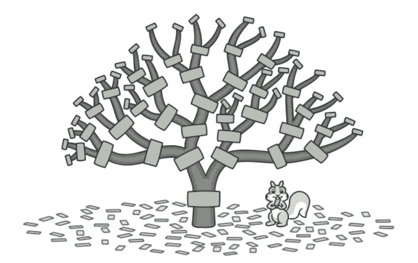
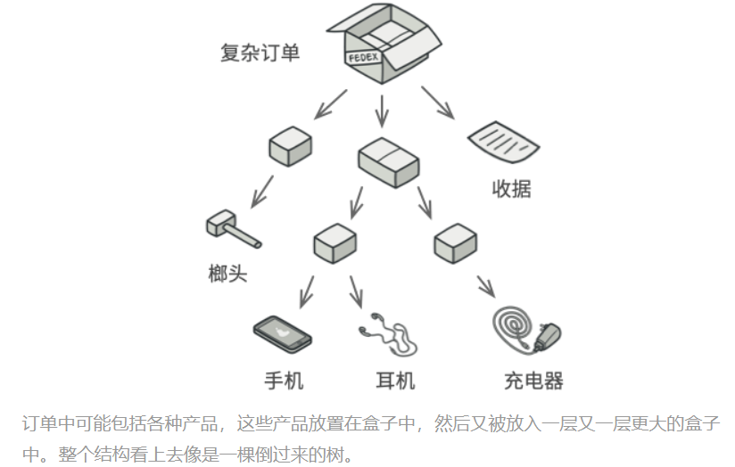
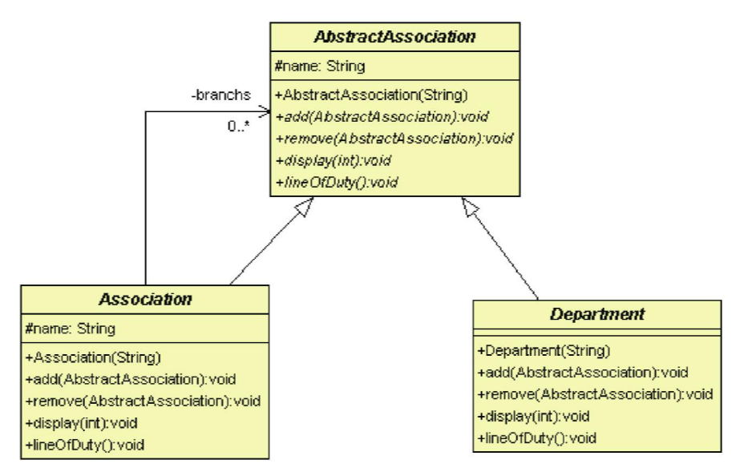

# 合成模式

## 目的

將物件組合成樹狀結構, 並能像使用獨立物件一樣使用他們





## 背景故事

冒險者協會在許多城鎮都成立了分會, 本來的協會變成冒險者總會, 分會底下還有子分會。<br>

另外, 每個協會都有一個客戶服務單位(Service Department)來接收委託和處理客訴, 另外也有人力資源單位(Human Resource)來招募冒險者。<br>

總會就像是樹的Root, 分會則是子節點(Node), 而客戶服務單位(Service Department)和人力資源單位(Human Resource)則是 Leaf。<br>

在合成模式中, Component是一個抽象類, Component代表有分支的節點, 通常會有add()、remove()方法加入和移除子節點, Leaf 則表示沒有更下一層的節點。

## 類別關係圖



## 適用場景

- 需要使用樹狀結構

- 希望客戶端程式碼以相同方式處理元素

## 優點

- 可以利用多型與遞迴方式更方便的使用樹狀結構

- 開閉原則: 無須更改原先程式碼, 就能添加新元素, 使其成為物件樹的一部分

## 缺點

- 可能只適合特定狀況

## 程式寫法 - C#

1. 抽象協會

    ```Csharp
    public abstract class AbstractAssociation
    {
        public string name { get; set; }

        public AbstractAssociation(string name)
        {
            this.name = name;
        }

        //新增分會
        public abstract void add(AbstractAssociation a);

        //移除分會
        public abstract void remove(AbstractAssociation a);

        //印出組織結構圖
        public abstract void display(int depth);

        //印出職責
        public abstract void lineOfDuty();
    }
    ```

2. Node: 冒險者協會

    ```Csharp
    public class Association : AbstractAssociation 
    {
        private List<AbstractAssociation> branchs = new List<AbstractAssociation>();

        public Association(string name) : base(name) 
        { 
        }

        public override void add(AbstractAssociation a)
        {
            this.branchs.Add(a);
        }

        public override void remove(AbstractAssociation a)
        {
            this.branchs.Remove(a);
        }

        //印出組織結構圖: 使用遞迴方法
        public override void display(int depth)
        {
            for (int i = 0; i < depth; i++) 
            {
                Console.Write("-");
            }

            Console.WriteLine(base.name);

            foreach (AbstractAssociation a in this.branchs)
            {
                a.display(depth + 2);
            }
        }

        //印出職責
        public override void lineOfDuty()
        {
            foreach (AbstractAssociation a in this.branchs)
            {
                a.lineOfDuty();
            }
        }
    }
    ```

3. Leaf: 部門單位

   ```Csharp
   // 部門單位
    public abstract class Department: AbstractAssociation
    {
        public Department(string name) : base(name) {}

        public override void add(AbstractAssociation a)
        {
            Console.WriteLine("Leaf cannot add node");
        }

        public override void remove(AbstractAssociation a)
        {
            Console.WriteLine("Leaf cannot remove node");
        }

        public override void display(int depth)
        {
            for (int i = 0; i < depth; i++) 
            {
                Console.Write("-");
            }

            Console.WriteLine(this.name);
        }

        public abstract override void lineOfDuty(); //到子類別再決定實作
    }

    //人力支援部門
    public class HumanResource : Department 
    {
        public HumanResource(string name) : base(name) { }

        public override void lineOfDuty()
        {
            Console.WriteLine(this.name + ": get people in");
        }
    }

    //客服部門
    public class ServiceDepartment : Department
    {
        public ServiceDepartment(string name) : base(name) { }

        public override void lineOfDuty()
        {
            Console.WriteLine(this.name + ": handle customers");
        }
    }
   ```

4. 測試結果

    ```Csharp
    class Program
    {
        static void Main(string[] args)
        {
            // 創建冒險者協會
            AbstractAssociation root = new Association("Adventrurer Head");
            root.add(new HumanResource("Adventrurer Head - Human Resource"));
            root.add(new ServiceDepartment("Adventrurer Head - Service Department"));

            //創建分會
            AbstractAssociation mars = new Association("Mars Adventrurer");
            mars.add(new HumanResource("Mars Adventrurer - Human Resource"));
            mars.add(new ServiceDepartment("Mars Adventrurer - Service Department"));
            root.add(mars);

            AbstractAssociation saturn = new Association("Saturn Adventrurer");
            saturn.add(new HumanResource("Saturn Adventrurer - Human Resource"));
            saturn.add(new ServiceDepartment("Saturn Adventrurer - Service Department"));
            root.add(saturn);

            //創建分會下的子分會
            AbstractAssociation saturn01 = new Association("Saturn 01 Adventrurer");
            saturn01.add(new HumanResource("Saturn 01 Adventrurer - Human Resource"));
            saturn01.add(new ServiceDepartment("Saturn 01 Adventrurer - Service Department"));
            saturn.add(saturn01);

            AbstractAssociation saturn02 = new Association("Saturn 02 Adventrurer");
            saturn02.add(new HumanResource("Saturn 02 Adventrurer - Human Resource"));
            saturn.add(saturn02);

            Console.WriteLine("");
            Console.WriteLine("--- Show Structure ---");
            Console.WriteLine("");

            root.display(1);

            Console.WriteLine("");
            Console.WriteLine("--- Show Duty ---");
            Console.WriteLine("");

            root.lineOfDuty();

            Console.ReadKey();
        }
    }
    ```

## 程式寫法 - python

1. 抽象協會

    ```python
    from abc import ABC, abstractmethod

    class AbstractAssociation(ABC):
        def __init__(self, name):
            self.name = name

        @abstractmethod
        def add(self, a):
            pass

        @abstractmethod
        def remove(self, a):
            pass

        @abstractmethod
        def display(self, depth):
            pass

        @abstractmethod
        def line_of_duty(self):
            pass
    ```

2. Node: 冒險者協會

    ```python
    class Association(AbstractAssociation):
        def __init__(self, name):
            super().__init__(name)
            self.branches = []

        def add(self, a):
            self.branches.append(a)

        def remove(self, a):
            self.branches.remove(a)

        def display(self, depth):
            for i in range(depth):
                print("-", end="")
            print(self.name)

            for a in self.branches:
                a.display(depth + 2)

        def line_of_duty(self):
            for a in self.branches:
                a.line_of_duty()
    ```

3. Leaf: 部門單位

    ```python
    from abc import abstractmethod
    from component import AbstractAssociation

    class Department(AbstractAssociation):
        def __init__(self, name):
            super().__init__(name)

        def add(self, a):
            print("Leaf cannot add node")

        def remove(self, a):
            print("Leaf cannot remove node")

        def display(self, depth):
            for i in range(depth):
                print("-", end="")
            print(self.name)

        @abstractmethod
        def line_of_duty(self):
            pass

    class HumanResource(Department):
        def __init__(self, name):
            super().__init__(name)

        def line_of_duty(self):
            print(self.name + ": get people in")

    class ServiceDepartment(Department):
        def __init__(self, name):
            super().__init__(name)

        def line_of_duty(self):
            print(self.name + ": handle customers")
    ```

4. 測試結果

    ```python
    # 創建冒險者協會
    root = Association("Adventurer Head")
    root.add(HumanResource("Adventurer Head - Human Resource"))
    root.add(ServiceDepartment("Adventurer Head - Service Department"))

    # 創建分會
    mars = Association("Mars Adventurer")
    mars.add(HumanResource("Mars Adventurer - Human Resource"))
    mars.add(ServiceDepartment("Mars Adventurer - Service Department"))
    root.add(mars)

    saturn = Association("Saturn Adventurer")
    saturn.add(HumanResource("Saturn Adventurer - Human Resource"))
    saturn.add(ServiceDepartment("Saturn Adventurer - Service Department"))
    root.add(saturn)

    # 創建分會下的子分會
    saturn01 = Association("Saturn 01 Adventurer")
    saturn01.add(HumanResource("Saturn 01 Adventurer - Human Resource"))
    saturn01.add(ServiceDepartment("Saturn 01 Adventurer - Service Department"))
    saturn.add(saturn01)

    saturn02 = Association("Saturn 02 Adventurer")
    saturn02.add(HumanResource("Saturn 02 Adventurer - Human Resource"))
    saturn.add(saturn02)

    print("\n--- Show Structure ---\n")
    root.display(1)

    print("\n--- Show Duty ---\n")
    root.line_of_duty()
    ```

