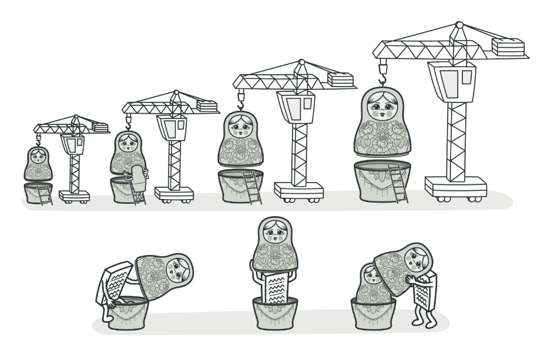
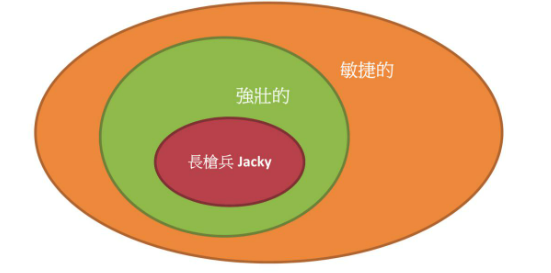

# 裝飾模式

## 目的

動態的將功能附加在物件上



## 背景故事

冒險者可以取得不同的稱號還裝飾自己，例如"晦瑟暗夜之冒險者"的敏捷較高, "炎龍的冒險者"攻擊力較高，而冒險者的稱號也能疊加，例如，"嘿瑟暗夜的炎龍冒險者"。<br>

如果說可選的稱號有3個，就必須建立3! = 6種子類別，如果有6個，就必須建立6! = 120種子類別，為避免這樣的情況，就必須使用**裝飾模式**



## 適用場景

- 需要在運行時為物件添加額外的行為

- 如果繼承擴展物件的行為難以實現或不可行，則該使用裝飾模式

## 優點

- 無須創建新子類即可擴展行為

- 可以自由添加或刪除物件的功能

## 缺點

- 各層的初始化配置程式碼可能看起來很複雜

## 程式寫法 - C#

1. 創建策略

    ```Csharp
    
    ```

2. 創建冒險者使用界面 (環境類別)

    ```Csharp
    
    ```

3. 測試結果

    ```Csharp
    
    ```

## 程式寫法 - python

1. 創建策略

    ```python
    
    ```

2. 創建冒險者使用界面 (環境類別)

    ```python
    
    ```

3. 測試結果

    ```python
    
    ```


