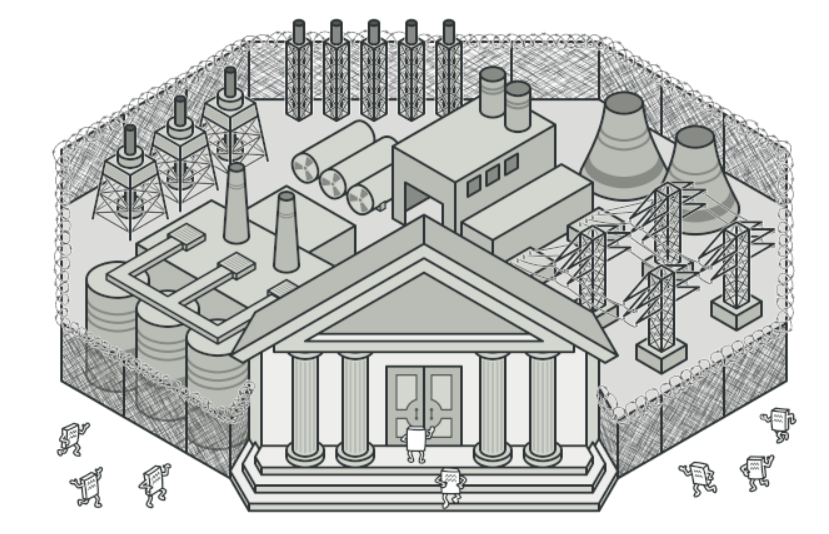
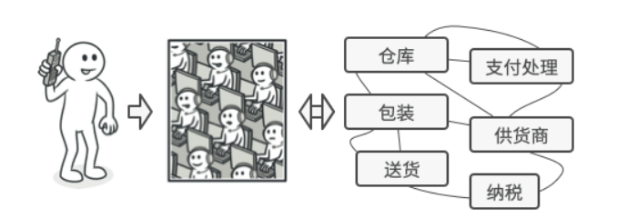
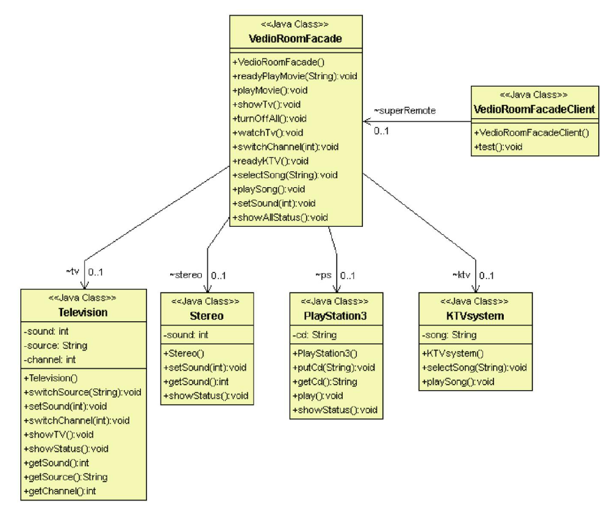
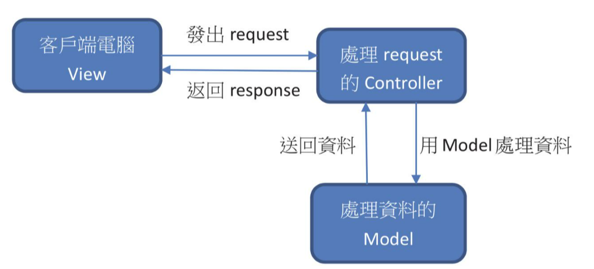

# 外觀模式

## 目的

用一個介面包裝各個子系統, 由介面跟客戶端做溝通





## 背景故事

想像家裡有一台PS3, 你打算用PS3來看電影, 步驟可能如下: 打開總電源, 打開電視盒電源, 開啟重低音放大器等三秒, 打開電視, 打開DVD撥放器, 打開PS3, 將電視來源選擇第二大項中的第三小項, 調整音量, 放入光碟片<br>

整套流程我們希望放入一個超級遙控器來完成, 超級遙控器就像是**外觀模式**, 把所有的操作封裝起來

## 類別關係圖



## 適用場景

- 指需要一個指向複雜子系統的接口, 且該接口的功能有限

- 如需要將子系統組織為多層結構時

## 優點

- 可以將程式碼獨立於複雜子系統

## 缺點

- 可能使外觀成為與所有子系統都耦合的[上帝對象](https://zh.wikipedia.org/zh-tw/%E4%B8%8A%E5%B8%9D%E5%AF%B9%E8%B1%A1)

## 程式寫法 - C#

1. 複雜子系統: 建置PS3跟KTV為例

    ```Csharp
    public abstract class Electronics
    {
        private bool power = false;

        public void powerOn()
        {
            this.power = true;
        }

        public void powerOff() 
        {
            this.power = false;
        }

        public bool isPowerOn() 
        {
            return this.power;
        }

        public virtual void showStatus() 
        {
            if (this.power)
            {
                Console.WriteLine(this.GetType().Name + " is working ");
            }
            else 
            {
                Console.WriteLine(this.GetType().Name + " not work ");
            }
        }
    }

    public class KTVSystem : Electronics 
    {
        private string song { get; set; }

        public void selectSong(string song) 
        {
            this.song = song;
        }

        public void playSong() 
        {
            Console.WriteLine(" play song: " + this.song);
        }
    }

    public class PS3 : Electronics 
    {
        private string CD { get; set; }

        public void putCD(string CD) 
        {
            this.CD = CD;
        }

        public void play() 
        {
            Console.WriteLine(" play CD: " + this.CD);
        }

        public override void showStatus() 
        {
            base.showStatus();
            if (isPowerOn()) 
            {
                Console.WriteLine(" play CD: " + this.CD);
            }
        }
    }
    ```

2. 外觀類: 超級遙控器

    ```Csharp
    class VedioRoomFacade
    {
        PS3 ps = new PS3();
        KTVSystem ktv = new KTVSystem();

        public void readyPlayMovie(string cd) 
        {
            ps.powerOn();
            ps.putCD(cd);
        }

        public void playMovie() 
        {
            if (ps.isPowerOn()) 
            {
                ps.play();
            }
        }

        public void turnOffAll() 
        {
            ktv.powerOff();
            ps.powerOff();
        }

        public void readKTV() 
        {
            ktv.powerOn();
        }

        public void selectSong(string song) 
        {
            if (ktv.isPowerOn()) 
            {
                ktv.selectSong(song);
            }
        }

        public void playSong() 
        {
            if (ktv.isPowerOn()) 
            {
                ktv.playSong();
            }
        }

        public void showAllStatus() 
        {
            ps.showStatus();
            ktv.showStatus();
        }
    }
    ```

3. 測試結果

    ```Csharp
    static void Main(string[] args)
    {
        VedioRoomFacade superRemote = new VedioRoomFacade();

        superRemote.showAllStatus();

        //Play KTV
        superRemote.readKTV();
        superRemote.selectSong("Moon");
        superRemote.playSong();
        superRemote.showAllStatus();

        Console.ReadKey();
    }
    ```

## 程式寫法 - python

1. 複雜子系統: 建置PS3跟KTV為例

    ```python
    class Electronics:
        def __init__(self):
            self.power = False

        def power_on(self):
            self.power = True

        def power_off(self):
            self.power = False

        def is_power_on(self):
            return self.power

        def show_status(self):
            if self.power:
                print(type(self).__name__ + " is working ")
            else:
                print(type(self).__name__ + " not work ")

    class KTVSystem(Electronics):
        def __init__(self):
            super().__init__()
            self.song = ""

        def select_song(self, song):
            self.song = song

        def play_song(self):
            print(" play song: " + self.song)

    class PS3(Electronics):
        def __init__(self):
            super().__init__()
            self.CD = ""

        def put_CD(self, CD):
            self.CD = CD

        def play(self):
            print(" play CD: " + self.CD)

        def show_status(self):
            super().show_status()
            if self.is_power_on():
                print(" play CD: " + self.CD)
    ```

2. 外觀類: 超級遙控器

    ```python
    from Electronics import PS3, KTVSystem

    class VideoRoomFacade:
        def __init__(self):
            self.ps = PS3()
            self.ktv = KTVSystem()

        def ready_play_movie(self, cd):
            self.ps.power_on()
            self.ps.put_CD(cd)

        def play_movie(self):
            if self.ps.is_power_on():
                self.ps.play()

        def turn_off_all(self):
            self.ktv.power_off()
            self.ps.power_off()

        def read_ktv(self):
            self.ktv.power_on()

        def select_song(self, song):
            if self.ktv.is_power_on():
                self.ktv.select_song(song)

        def play_song(self):
            if self.ktv.is_power_on():
                self.ktv.play_song()

        def show_all_status(self):
            self.ps.show_status()
            self.ktv.show_status()
    ```

3. 測試結果

    ```python
    from VedioRoomFacade import VideoRoomFacade

    superRemote = VideoRoomFacade()

    superRemote.show_all_status()

    #Play KTV
    superRemote.read_ktv()
    superRemote.select_song("Moon")
    superRemote.play_song()
    superRemote.show_all_status()
    ```

## 後記

外觀模式常見於MVC架構, 例如Controller對應一個網頁功能, 會呼叫好幾組Model交叉使用處理資料, 若又有一個Service整合這些Model來讓Controller 更幫變取得資料, 那這個Service 其實就是一個Facade設計

