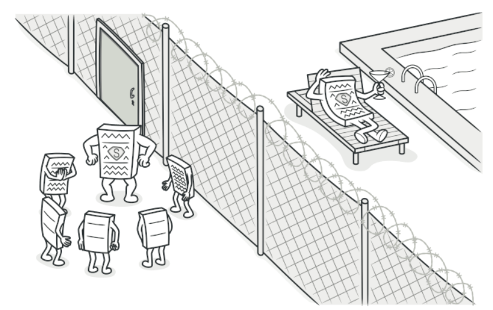
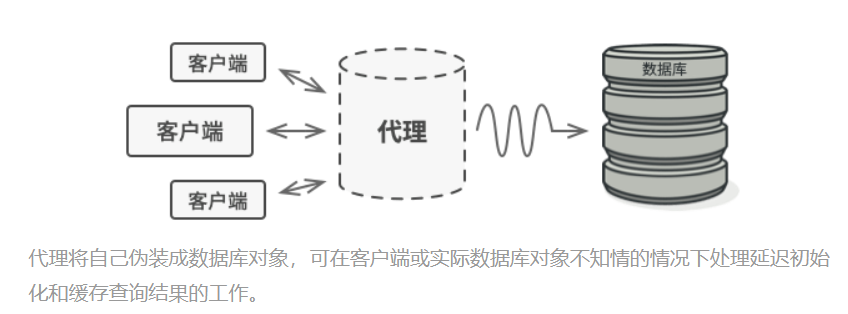
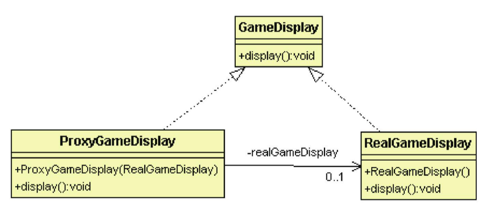

# 代理模式

## 目的

為一個物件提供代理物件。常見用途如下:

- 虛擬代理: 用比較不耗資源的代理物件來代替實際物件

- 遠程代理: 在本地端提供一個物件來存取遠端網址物件

- 保護代理: 限制其他程式存取權限

- 智能代理: 為被代理的物件增加一些動作





## 背景故事

讀取冒險者遊戲可能會花費很多時間, 可以使用一個代理類別, 讓遊戲還在讀取時先顯示"遊戲讀取中..."<br>

**代理模式**一般只會包一層, 而**裝飾模式**可能套很多層, 可以把**裝飾模式**當成特化版的**代理模式**

## 類別關係圖



## 優點

- 職責清晰與高擴展

## 缺點

- 有些類型的請求過程可能導致速度變慢

## 程式寫法 - C#

1. 建立被代理與代理者

    ```Csharp
    public abstract class GameDisplay
    {
        public abstract void play();
    }

    //被代理的類別
    public class RealGameDisplay : GameDisplay 
    {
        public override void play()
        {
            Console.WriteLine("--- Show game ---");
        }
    }

    //代理類別
    public class ProxyGameDisplay : GameDisplay 
    {
        private RealGameDisplay realGameDisplay;

        public ProxyGameDisplay(RealGameDisplay realGameDisplay) 
        {
            this.realGameDisplay = realGameDisplay;
        }

        public override void play()
        {
            Console.WriteLine("--- Loading game ---");
            this.realGameDisplay.play(); //跑這段程式碼可能要花費很多時間
        }
    }
    ```

2. 測試結果

    ```Csharp
    class Program
    {
        static void Main(string[] args)
        {
            ProxyGameDisplay proxyGameDisplay = new ProxyGameDisplay(new RealGameDisplay());
            proxyGameDisplay.play();
            Console.ReadKey();
        }
    }
    ```

## 程式寫法 - python

1. 建立被代理與代理者

    ```python
    from abc import ABC, abstractmethod

    class GameDisplay(ABC):
        @abstractmethod
        def play(self):
            pass

    class RealGameDisplay(GameDisplay):
        def play(self):
            print("--- Show game ---")

    class ProxyGameDisplay(GameDisplay):
        def __init__(self, realGameDisplay: RealGameDisplay):
            self.__realGameDisplay = realGameDisplay
    
        def play(self):
            print("--- Loading game ---")
            self.__realGameDisplay.play()
    ```

3. 測試結果

    ```python
    from GameDisplay import ProxyGameDisplay, RealGameDisplay

    proxyGameDisplay = ProxyGameDisplay(RealGameDisplay())

    proxyGameDisplay.play()
    ```